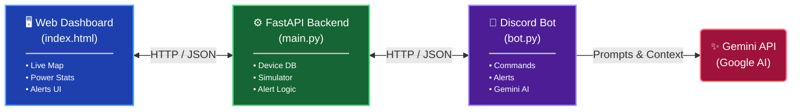
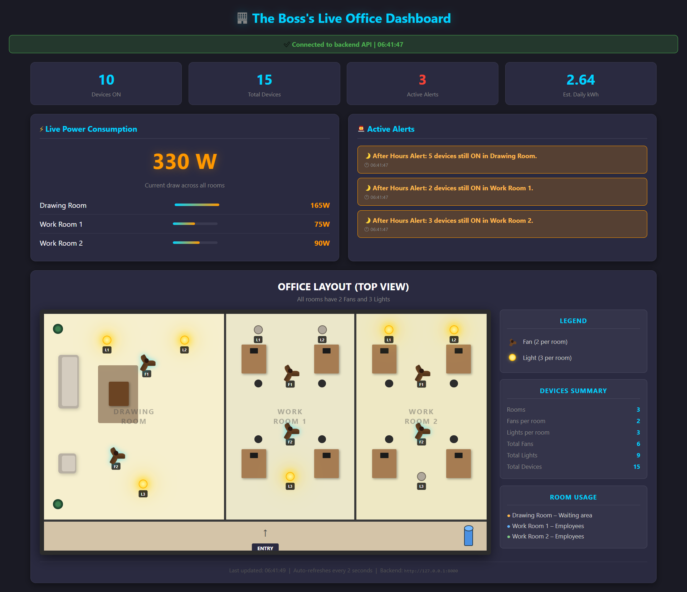
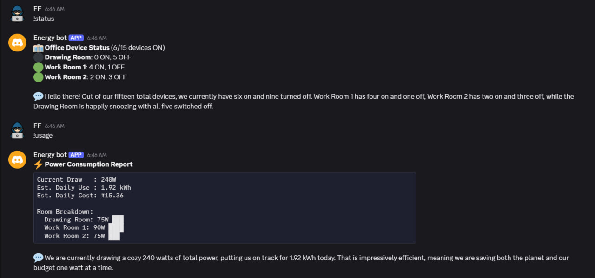
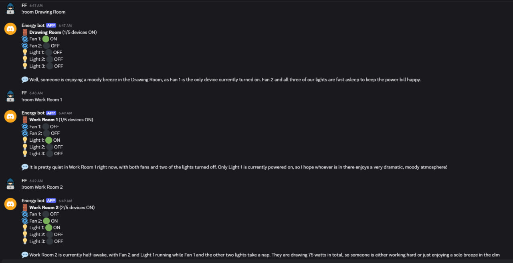
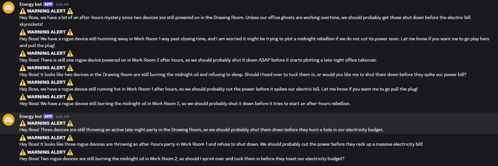

# 🏢 Lights, Fans, Discord: The Boss's Big Idea

> A smart office monitoring system that tracks devices in real-time, visualizes them on a live floor plan, sends proactive AI-powered alerts to Discord, and helps reduce energy waste.


---

## 📋 Table of Contents

- [Overview](#-overview)
- [Features](#-features)
- [System Architecture](#-system-architecture)
- [Tech Stack](#-tech-stack)
- [Project Structure](#-project-structure)
- [Setup Instructions](#-setup-instructions)
- [Running the Project](#-running-the-project)
- [API Documentation](#-api-documentation)
- [Discord Bot Commands](#-discord-bot-commands)
- [Screenshots](#-screenshots)
- [Troubleshooting](#-troubleshooting)
- [License](#-license)

---

## 🎯 Overview

The boss has an office with **3 rooms** (1 Drawing Room + 2 Work Rooms), each containing **2 fans and 3 lights** — a total of **15 devices**. Employees often forget to turn devices off, wasting electricity and money.

This project solves that with:

- 🖥️ **Live Web Dashboard** — Top-down floor plan showing real-time device status
- 🤖 **Discord AI Bot** — Answers natural questions and sends proactive alerts
- ⚡ **FastAPI Backend** — Simulates devices, calculates power, detects anomalies
- 🧠 **Gemini AI Integration** — Turns raw data into friendly human-readable messages

---

## ✨ Features

### 🖥️ Web Dashboard
- 📊 Real-time power consumption meter (updates every 2 seconds)
- 🏢 Interactive top-view office floor plan
- 💡 Lights that glow yellow when ON with realistic ambient light spread
- 🌀 Ceiling fans that spin visually when ON
- 🚨 Live alerts panel with color-coded severity
- 📈 Per-room power breakdown with bar visualizations
- 🔌 Backend connection status indicator

### 🤖 Discord Bot
- `!status` — Overall device status across all rooms
- `!room <name>` — Detailed status of a specific room
- `!usage` — Current wattage + estimated daily kWh + cost in ₹
- `!alerts` — Manual check for anomalies
- `!ping` — System health check
- 🔔 **Proactive alerts** every minute for anomalies

### 🚨 Smart Alerts
- 🌙 **After-Hours Alert** — Detects devices left on outside 9 AM – 5 PM
- 🔴 **Continuous Usage Alert** — Warns when all devices in a room run for 2+ hours

---

## System Architecture

The project utilizes a decoupled architecture where a central FastAPI backend serves data to a web frontend and communicates with a Discord bot interface powered by Google's Gemini AI.



### Component Breakdown

* **Web Dashboard (`index.html`)**: The frontend interface for users to monitor the system. It visualizes the live map, displays real-time power statistics, and provides a dedicated UI for managing alerts.
* **FastAPI Backend (`main.py`)**: The core engine and central hub of the system. It handles HTTP requests, manages the device database, runs system simulations, and continuously evaluates conditions to trigger alert logic.
* **Discord Bot (`bot.py`)**: A ChatOps interface that allows users to interact with the system via Discord commands. It receives alerts from the backend and integrates directly with Google's Gemini AI to provide intelligent, contextual responses.
* **Gemini API**: External AI service utilized by the Discord bot to enhance user interaction, analyze alerts, or answer queries organically.


📐 See [`diagrams/architecture.png`](./diagrams/architecture.png) for the full system diagram.  
📐 See [`diagrams/office-layout.png`](./diagrams/office-layout.png) for the office floor plan reference.

---

## 🛠️ Tech Stack

| Component | Technology |
|-----------|-----------|
| **Backend** | FastAPI, Uvicorn, Python 3.10+ |
| **Frontend** | HTML5, CSS3, Vanilla JavaScript |
| **Bot** | discord.py 2.3+ |
| **AI/LLM** | Google Gemini 2.5 Flash (`google-genai` SDK) |
| **Data Store** | In-memory Python dict (no database required) |

---

## 📁 Project Structure

```text
lights-fans-discord/
│
├── main.py                # FastAPI backend + device simulator
├── bot.py                 # Discord bot with Gemini AI
├── index.html             # Live web dashboard
├── requirements.txt       # Python dependencies
├── .env.example           # Template for environment variables
├── .gitignore             # Prevents secrets/venv from being pushed
├── README.md              # This file
│
├── diagrams/
│   ├── architecture.png   # System architecture diagram
│   ├── office-layout.png  # Office floor plan reference
│   └── data-flow.png      # Data flow diagram
│
└── screenshots/
    ├── dashboard.png      # Web dashboard view
    ├── discord-alerts.png # Bot in action
    └── discord-commands.png # Bot command examples
```
text


---

## 🚀 Setup Instructions

### Prerequisites

- **Python 3.10+** installed ([Download here](https://www.python.org/downloads/))
- **Discord account** with a server where you can add bots
- **Google account** (for free Gemini API access)
- **Modern web browser** (Chrome, Firefox, Edge)

---

## 🚀 Installation & Setup

### Step 1: Clone the Repository

```bash
git clone [https://github.com/YOUR_USERNAME/lights-fans-discord.git](https://github.com/YOUR_USERNAME/lights-fans-discord.git)
cd lights-fans-discord
```

### Step 2: Create a Virtual Environment & Install Dependencies

**Windows (PowerShell):**
```powershell
python -m venv .venv
.venv\Scripts\Activate.ps1
pip install -r requirements.txt
```

**macOS / Linux:**
```bash
python3 -m venv .venv
source .venv/bin/activate
pip install -r requirements.txt
```

### Step 3: Get Your API Keys

**🔑 Discord Bot Token**
1. Go to the [Discord Developer Portal](https://discord.com/developers/applications).
2. Click **New Application** and give it a name.
3. Go to **Bot** in the left sidebar and click **Add Bot**.
4. Under the "Token" section, click **Reset Token** and copy it.
5. **Important:** Enable the **Message Content Intent** and **Server Members Intent**.
6. Go to **OAuth2 > URL Generator**:
   * Scopes: `bot`
   * Bot Permissions: `Send Messages`, `Read Message History`
7. Copy the generated URL and paste it into your browser to invite the bot to your server.

**🔑 Gemini API Key**
1. Go to [Google AI Studio](https://aistudio.google.com/app/apikey).
2. Click **+ Create API Key** and choose "Create in new project".
3. Copy the key (it should start with `AIzaSy...`).

**🔑 Discord Channel ID**
1. In Discord, enable Developer Mode (**Settings → Advanced → Developer Mode**).
2. Right-click on the text channel where you want alerts to appear and select **Copy Channel ID**.

### Step 4: Configure Environment Variables

Create a `.env` file in the project root (you can copy from `.env.example`):

```env
DISCORD_TOKEN=your_discord_bot_token_here
GEMINI_API_KEY=AIzaSy_your_gemini_key_here
ALERT_CHANNEL_ID=1234567890123456789
```
> **⚠️ Note:** Never commit your `.env` file to Git! It is already included in the `.gitignore`.

---

## ▶️ Running the Project

You will need **3 terminal windows** open (ensure your virtual environment is activated in each).

**Terminal 1 — Start the Backend API**
```bash
python main.py
```
*Expected Output:* `✅ Backend API started successfully! 📡 API available at: http://127.0.0.1:8000`

**Terminal 2 — Start the Discord Bot**
```bash
python bot.py
```
*Expected Output:* `✅ Bot logged in as: Energy bot | ✅ Backend API connection: SUCCESSFUL`

**Terminal 3 — Open the Dashboard**
Simply open `index.html` in your web browser:
* **Windows:** `start index.html`
* **macOS:** `open index.html`
* **Linux:** `xdg-open index.html`

---

## 📡 API Documentation

Once the backend is running, interactive API docs (Swagger UI) are automatically available at: **http://127.0.0.1:8000/docs**

### Endpoints

| Method | Endpoint | Description |
| :--- | :--- | :--- |
| `GET` | `/` | API Health check |
| `GET` | `/api/devices` | Get all 15 devices with current status |
| `GET` | `/api/power` | Get current power consumption per room |
| `GET` | `/api/alerts` | Get active alerts |
| `POST` | `/api/devices/{id}/toggle` | Manually toggle a specific device |

### Example Response (`GET /api/devices`)
```json
{
  "devices": [
    {
      "id": 1,
      "name": "Fan 1",
      "type": "fan",
      "room": "Drawing Room",
      "status": "on",
      "power_draw_watts": 60,
      "last_changed": "2025-01-15T14:30:22.123456"
    }
  ]
}
```

---

## 🤖 Discord Bot Commands

| Command | Description | Example |
| :--- | :--- | :--- |
| `!ping` | Check bot & API health status | `!ping` |
| `!status` | Quick overview of all devices | `!status` |
| `!room <name>` | Details of a specific room | `!room Drawing Room` |
| `!usage` | Real-time power & cost report | `!usage` |
| `!alerts` | Manually check for active alerts | `!alerts` |
| `!help_office` | Show all available commands | `!help_office` |

### 🔔 Automatic Alerts
The bot continuously monitors the backend and posts alerts to the configured channel every minute when:
* Devices are left **ON** outside of business hours (9 AM – 5 PM).
* Devices in a room have been **ON for 2+ hours** continuously.

---

## 📸 Screenshots

**Web Dashboard** 

**Discord Bot Commands**  

**Proactive Alerts** 

---

## 🔧 Troubleshooting

**❌ "Backend offline" on dashboard**
* Make sure `python main.py` is running in a separate terminal.
* Check that port `8000` is not being used by another application.
* Verify your firewall is not blocking `localhost:8000`.

**❌ Discord bot: "Improper token has been passed"**
* Your token was likely revoked by Discord (often happens if exposed publicly).
* Reset it at the Discord Developer Portal → Bot → Reset Token.

**❌ Gemini: "PERMISSION_DENIED"**
* You are likely using a Google Cloud Console key (starts with `AQ.`), which is the wrong format.
* Get an AI Studio key (starts with `AIzaSy`) from `aistudio.google.com/app/apikey`.

**❌ Bot connects but sends no alerts**
* Verify `ALERT_CHANNEL_ID` matches your exact Discord channel.
* Ensure the bot has the "Send Messages" permission in that specific channel.
* *Note: Alerts only trigger outside 9 AM–5 PM, or after 2+ hours of continuous usage.*

**❌ Dashboard shows devices, but no map updates**
* Open your browser's DevTools (F12) and check the Console tab for errors.
* CORS errors usually indicate the backend isn't running or `allow_origins` is misconfigured in `main.py`.

---

## 🎬 Demo Video
📺 [Watch the demo video here](#) *(Link to your video)*

## 🤝 Contributing
Pull requests are welcome! For major changes, please open an issue first to discuss what you would like to change.

## 📜 License
This project is licensed under the MIT License — see the LICENSE file for details.

## 👤 Author
**Fahim-Foysal**
* GitHub: [@Fahim-Foysal-FF](https://github.com/Fahim-Foysal-FF)
* Discord: `FF28.`

## 🙏 Acknowledgments
* Built for the *"Lights, Fans, Discord: The Boss's Big Idea"* hackathon challenge.
* Powered by **FastAPI**, **discord.py**, and **Google Gemini**.
* Inspired by real-world office energy waste problems.
